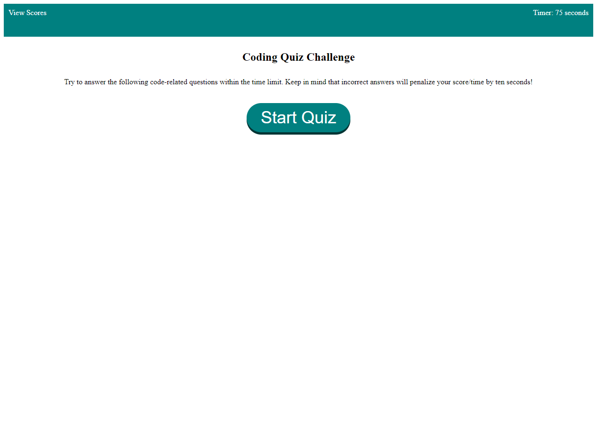

# 04-Web-APIs-Code-Quiz
Web APIs Code Quiz

## Description 
This challenge was completed to create a code quiz. It was created to build a timed coding quiz with multiple-choice questions. This app will run in the browser and will feature dynamically updated HTML and CSS powered by JavaScript code that you write. It will have a clean, polished, and responsive user interface.

## Link to application
https://gioq89.github.io/04-Web-APIs-Code-Quiz/

## Screenshot

## Usage 
To use this assignment, click on the start quiz button and answer the questions. Once you complete the quiz, you will be prompted to add your initials to the high score table!

## Credits N/A

## License N/A
